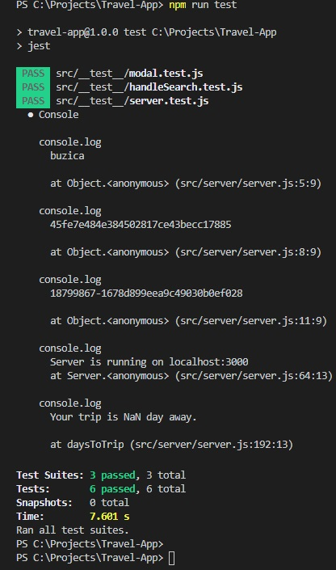

# Travel-App :earth_africa:

Last project for **Udacity** course.<br>
Combining all the Front End skills learned into a capstone project.<br>
This project is based on Webpack, Node.js and complemented by three external API's.<br>
These API's are:<br>
* **Geonames**: geographical database that covers all countries;
* **Weatherbit**: weather data;
* **Pixabay**: image data.


## Starting the App

Clone or fork the project.<br>
Then install all the required packages:

`cd` into your new folder and run:
```
npm install
```

#### Dependencies:

    "@babel/polyfill": "^7.12.1",
    "axios": "^0.20.0",
    "body-parser": "^1.19.0",
    "cors": "^2.8.5",
    "dev-server": "^0.1.0",
    "dotenv": "^8.2.0",
    "express": "^4.17.1",
    "webpack": "^5.1.3",
    "webpack-cli": "^4.1.0"

## Set the API's

An account must be created on all three API's to access the information needed and to validate the requests.

* [Geonames](http://www.geonames.org/export/web-services.html)
* [Weatherbit](https://www.weatherbit.io/account/create)
* [Pixabay](https://pixabay.com/api/docs/)

#### Environment Variables

Declare the API keys.<br>
Create a `.env file`; should look like:
```
GEO_USERNAME="your-api-username"
WEATHER_API_KEY="your-api-key"
PIXABAY_API_KEY="your-api-key"
```

## Set the App

To run the project on the development webpack server, open the terminal in the root directory and run the command:

```
npm run dev
```

To run the project on the production webpack server, open terminal in the root directory and run the command:

```
npm run build
```
To run the server:

```
npm run start
```

#### App in the browser
Click [here](http://localhost:3000/) to see the app in the browser.

## Tests

To run the tests run the command:
```
npm run test
```
It should appear in the terminal that every code tested passed. Like so:



## Author

[Cristiana Costa Pereira](https://github.com/CristianaCostaPereira) :octocat:

# Special thanks
**Nuno Mendonça** :blush:<br>
There are no words that can *express* my gratitude.<br>
**THANK YOU!** :sweet_potato::jack_o_lantern: